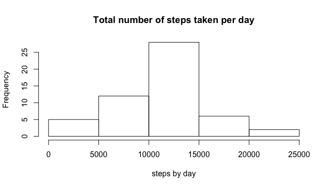
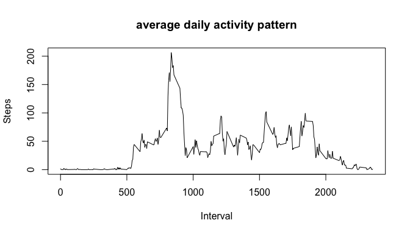
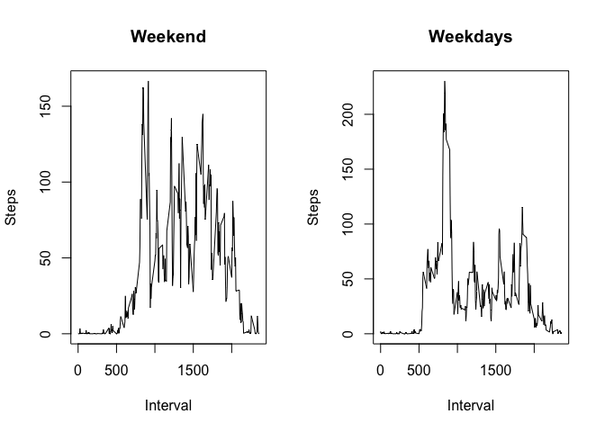

# Reproducible Research: Peer Assessment 1


## Loading and preprocessing the data

```r
library(dplyr)
```

```
## 
## Attaching package: 'dplyr'
## 
## The following objects are masked from 'package:stats':
## 
##     filter, lag
## 
## The following objects are masked from 'package:base':
## 
##     intersect, setdiff, setequal, union
```

```r
library(ggplot2)
```

Loading the data

```r
df <- read.csv("activity.csv")
```

Removing the NA values

```r
data <- df %>% filter(!is.na(steps))
```

## What is mean total number of steps taken per day?

```r
total.steps.day <- data %>% select(steps, date) %>% filter(!is.na(steps)) %>% 
    group_by(date) %>% summarize(sum(steps))

hist(total.steps.day$`sum(steps)`,xlab = "steps by day", 
     main = "Total number of steps taken per day")
```

 

```r
meanx <- mean(total.steps.day$`sum(steps)`)

medianx <- median(total.steps.day$`sum(steps)`)
```

* The mean of the total number of steps taken per day is 1.0766189\times 10^{4}

* The median of the total number of steps taken per day is 10765

## What is the average daily activity pattern?

```r
ave.steps.by.interval <- df %>% select(steps, interval) %>% filter(!is.na(steps)) %>% 
    group_by(interval) %>% summarise(steps = mean(steps))

names(ave.steps.by.interval) <- c("interval", "steps")

plot(x=ave.steps.by.interval$interval, 
     y=ave.steps.by.interval$steps,
     type = "l",
     xlab = "Interval",
     ylab = "Steps",
     main = "average daily activity pattern")
```

 

```r
max.steps.by.interval <- max(ave.steps.by.interval$steps)

max.interval <- ave.steps.by.interval[which(ave.steps.by.interval$steps ==
    max.steps.by.interval),1]
```
* The 5-minute interval, on average across all the days in the dataset, that contains the maximum number of steps(206.1698113) is 835 

## Imputing missing values

```r
total.rows <- df %>% count
total.rows.na <- df %>% filter(is.na(steps)) %>% count
```
* Total number of values in the dataset = 17568

* Total number of missing values in the dataset = 2304


```r
## strategy: filling in all of the missing values in the dataset with the mean for that 5-minute interval
data.only.na <- df %>% filter(is.na(steps))

data.only.na$steps <- ave.steps.by.interval[match(data.only.na$interval,
    ave.steps.by.interval$interval),]$steps

new.data <- rbind(data, data.only.na)

new.data <- arrange(new.data, date)
```


```r
new.total.steps.day <- new.data %>% select(steps, date)  %>% 
    group_by(date) %>% summarize(steps = sum(steps))

hist(new.total.steps.day$steps,xlab = "steps by day", 
     main = "Total number of steps taken per day")
```

 

```r
new.meanx <- mean(new.total.steps.day$steps)

new.medianx <- median(new.total.steps.day$steps)
```

*Do these values differ from the estimates from the first part of the assignment?* 

* New values: Mean = 1.0766189\times 10^{4}, Median = 1.0766189\times 10^{4} 

*What is the impact of imputing missing data on the estimates of the total daily number of steps?*

* There is no impact.

## Are there differences in activity patterns between weekdays and weekends?

```r
new.df <- new.data %>% mutate(day=ifelse(weekdays(as.Date(date)) %in% c("Saturday","Sunday"), "Weekend", "Weekday"))

new.ave.steps.by.interval.weekend <- new.df  %>% filter(day == "Weekend") %>% 
    group_by(interval) %>% summarise(steps = mean(steps))

new.ave.steps.by.interval.weekday <- new.df  %>% filter(day == "Weekday") %>% 
    group_by(interval) %>% summarise(steps = mean(steps))

par(mfrow = c(1, 2))
plot(x=new.ave.steps.by.interval.weekend$interval, 
     y=new.ave.steps.by.interval.weekend$steps,
     type = "l",
     xlab = "Interval",
     ylab = "Steps",
     main = "Weekend")

plot(x=new.ave.steps.by.interval.weekday$interval, 
     y=new.ave.steps.by.interval.weekday$steps,
     type = "l",
     xlab = "Interval",
     ylab = "Steps",
     main = "Weekdays")
```

 
